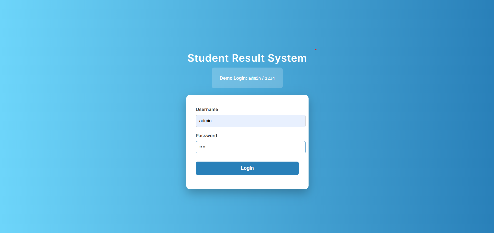
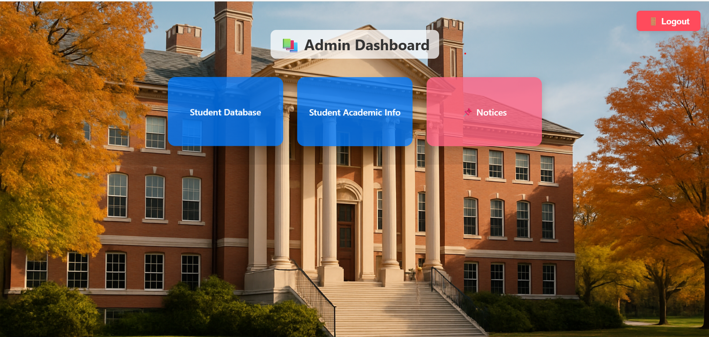
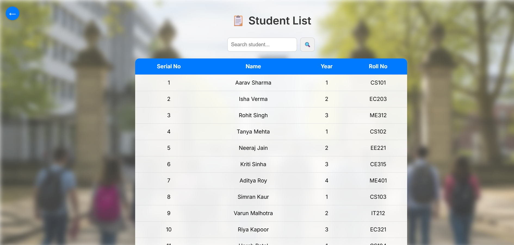
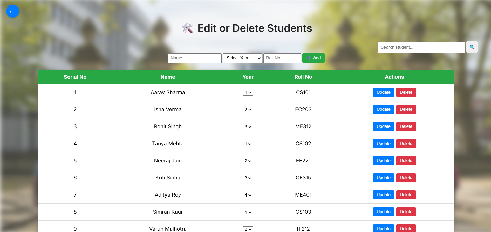
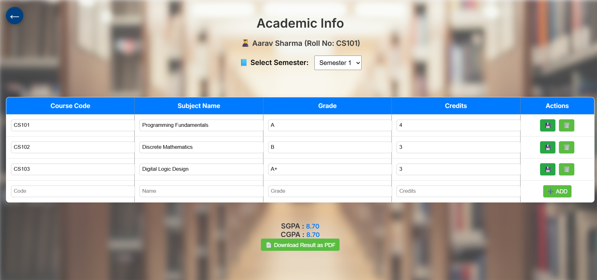
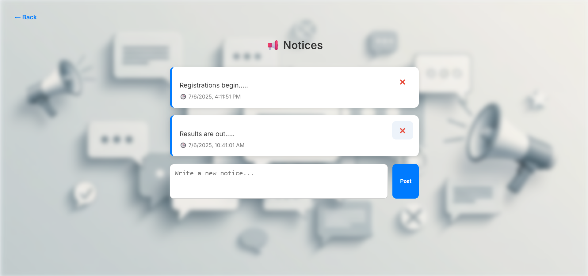

# 🎓 Student Result System

A complete full-stack web application to manage and view student academic records semester-wise. Built with clean UI, secure login, and structured database integration.

---

## 🔧 Features

- 🔐 **Authentication System**: Secure login page to access the dashboard.
- 📊 **Dashboard**: Neatly designed with cards for:
  - Student Database
  - Academic Info
  - Notices
- 🧾 **Student Database**:
  - View all registered students
  - Add or remove student records
- 📚 **Academic Info**:
  - Semester-wise subject entry
  - Grade, Credit input per subject
  - Automatic SGPA & CGPA calculation
- 📢 **Notice Section**:
  - Post and display public messages
  - View/delete notices (admin control)

---

## 🛠️ Tech Stack

### Frontend:
- HTML, CSS, JavaScript
- Responsive Design
- Simple UI interactions

### Backend:
- Node.js + Express.js
- MySQL (Database)
- RESTful APIs

---

## 💾 Database Structure

Three main tables:
1. `students` – Stores basic student details
2. `student_subjects` – Stores semester-wise subject performance
3. `notices` – Stores posted notice messages

SQL dump is included in the `/sql` folder.

---

## 📁 Project Structure

student-result-system/

│
├── frontend/

│ ├── dashboard.html
│ ├── academic.html
│ ├── login.html
│ └── css/ and js/
│
├── backend/

│ ├── server.js
│ └── routes, config, etc.
│
├── sql/

│ ├── students.sql
│ ├── student_subjects.sql
│ └── notices.sql
│
└── README.md

## 📸 Screenshots

### 🔐 Login Page

### 🏠 Dashboard

### 🧑‍🎓 Student Database - View

### 📝 Edit Student Info

### 🎓 Academic Info with SGPA & CGPA

### 📢 Notices Page

